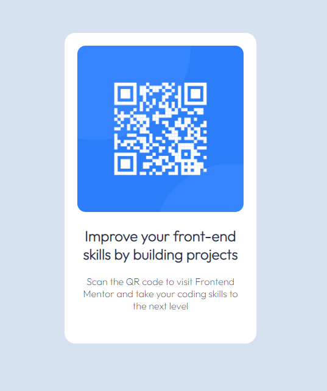

# Frontend Mentor - QR code component solution

This is a solution to the [QR code component challenge on Frontend Mentor](https://www.frontendmentor.io/challenges/qr-code-component-iux_sIO_H).

## Screenshot
 

 

## Links

- Solution URL: https://qr-code-component-by-thomas.netlify.app/

 

## Built with

- Semantic HTML5 markup
- CSS custom properties
- Flexbox